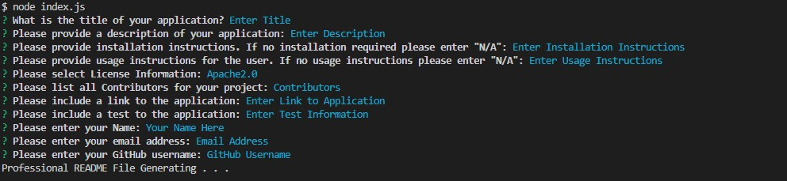

# Professional ReadMe Generator

## Description

This is a Node.js application that allows a user to create a professional README file. This will save the user time creating a README file so they can spend more time coding on their respective project.

## Installation

This application is run using Node.JS. User must ensure Node.js is installed in order to utilize this application.

## Usage

The user will answer a series of prompts that will generate the professional README file. The questions include "Title", "Description", "Installation Instructions", "Usage Instructions", "License Used", "Contributors", "Link to Application", "Testing for Application", "Name", "Email", and "GitHub username." Once all questions are answered, this application will generate a professional README file that includes all of the information the user entered.

## Credits

Guidance Provided by AskBCSLearningAssistant: Lindelwe, username "Imyeza".

Tutoring advice provided by: Rene Trevino.

Project done in collaboration with coding students Kalyn Sifuentes, Joshua Hale, and Angela Cortes.

YouTube Video accessed for function guidance: https://www.youtube.com/watch?v=9YivEQFpmHQ&t=132s by DopeDev.

Starter Code source: https://github.com/coding-boot-camp/potential-enigma.git

## Screenshots

## Link to Website

N/A

## License

N/A